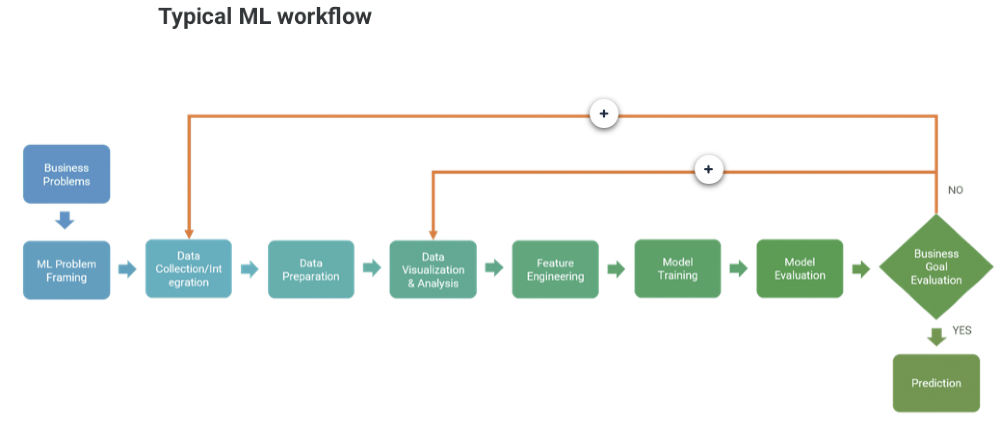

# Inventory Error ML Solutions

Machine learning solutions for dealing with error in NJ state forest inventory data.

### Crown Class Classification

[Crown Class Classification Notebook](https://github.com/New-Jersey-Forest-Service/InventoryErrorMLSolutions/blob/master/CrownClass/Classification%20V2.ipynb)

- The goal:
  - Bring in the forest inventory data from the consultant and try to correct the errors in the crown class feature.
 
### Pitch Pine/Short Leaf Classification

[Pitch Pine/Short Leaf Classification Notebook](https://github.com/New-Jersey-Forest-Service/InventoryErrorMLSolutions/blob/master/PitchPineShortLeaf/Classification%20V1.ipynb)

- The goal:
  - Bring in the forest inventory data from the consultant and try to correct the errors in the species identification of Pitch Pine and/or Short Leaf. These two species are somewhat difficult to ID between each other and can easily get mixed up.
